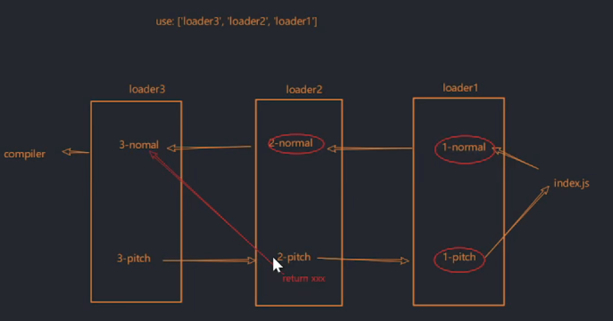
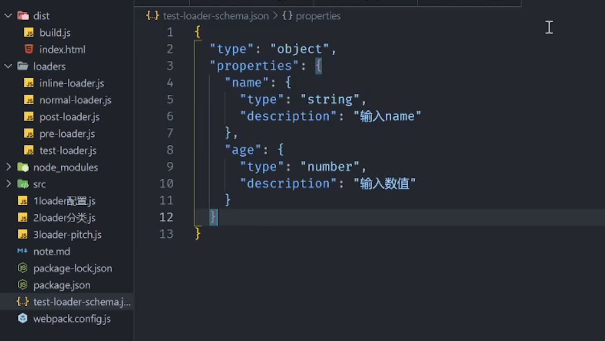
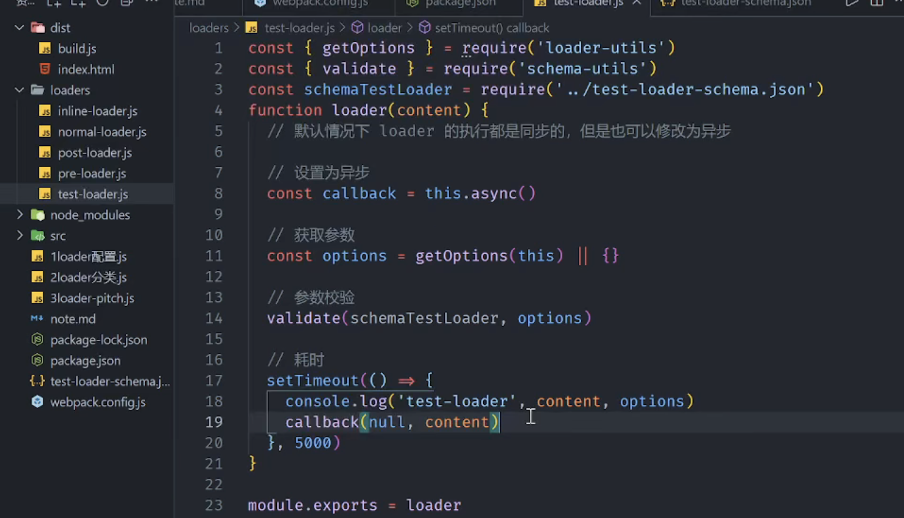
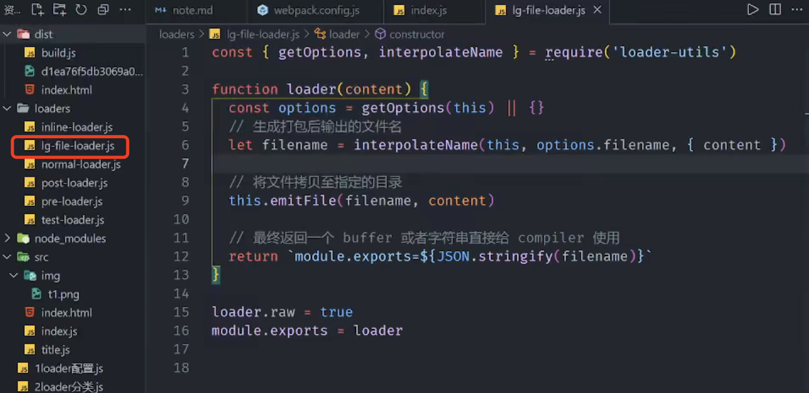

# loader

## loader 使用

1、loader 本质上为一个导出内容为函数的 js 模块
2、loader 默认就接收上游传递过来的资源文件或者结果
3、compiler 会拿到最后一个 loader 的产出结果，这个结果是 string 或者 buffer
例如： file-loader 处理图片的时候干了什么?

- 返回一个字符串形式的图片路径
- 资源拷贝一份到指定目录

4、从入口文件触发，找到所有依赖的模块，知道所有依赖模块也被 loader 处理之后返回结果

## loader 分类

> 对于 loader 默认都是一样的，在使用的时候可以放在不同的位置或者进行了不同的修饰，因此说起来 loader 就有了分类

1、普通 loader：没有做任何配置
2、前置 loader：enforce 属性配置 pre
3、后置 loader：enforce 属性配置 post
4、行内 loader：使用！进行分割

## loader 符号

```javascript
const title = require("-!inline-loader!./title");
```

1、! 屏蔽 normal-loader
2、- 屏蔽 pre-loader
3、!!屏蔽 只剩 inline，屏蔽其他三个

## loader 组成

1、同步 loader

```javascript
let callback = this.callback();
callback(err, ...values);
```

2、异步 loader

```javascript
let callback = this.async();
callback(err, ...values);
```

3、raw loader(处理 blob 流文件)

```javascript
module.exports = function (content) {
  return content;
};
moudle.exports.raw = true;
```

```javascript
function loader(content) {
  return content;
}
loader.raw = true;
moudle.exports = loader;
```

4、pitch loader

```javascript
module.exports = function (content) {
  return content;
};
moudle.exports.pitch = function () {
  console.log("pitch");
};
```

> 一个完整的 loader 是由 normalLoader pitchLoader 两部分组成的



## loader 获取配置参数

> options 中的配置在 loader 中的应用

```javascript
const { getOptions } = require("loader-utils");
```

## loader 参数校验


additionalProperties: false 不允许再有其他额外属性


## file-loader



## loader 实现

## HMR（HotModuleReplacement）
