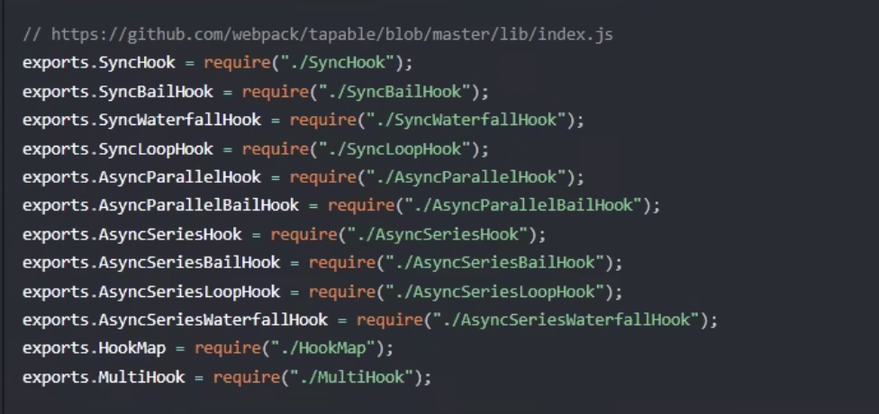
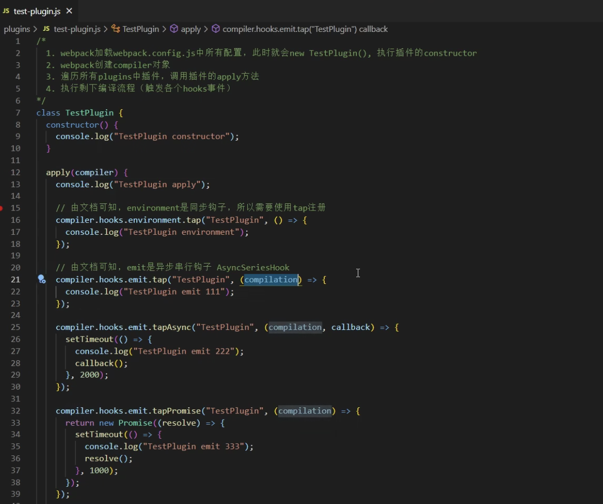

# plugin

## plugin 作用

通过插件我们可以扩展 webpack，加入自定义的构建行为，使 webpack 可以执行更广泛的任务，拥有更强的构建能力

## plugin 工作原理

> webpack 就像一条生产线，要经过一系列流程后才能将源文件转换为输出结果，这条生产线上的每个处理流程的职责都是单一的，多个流程之间窜在依赖关系，只有完成当前处理后才能交给下一个流程处理。插件就想是一个插入到生产线中的一个功能，在待定的时机对生产线上的资源做处理，webpack 通过$\color{#ff0000}{Tapable}$来组织这条复杂的生产线。webpack 在运行过程中会广播事件，插件只需要监听他所关心的事件，就能加入到这条生产线中，去改变生产线的运作。webpack 的事件流机智报成了插件的有序性，是整个系统扩展性更好——【深入浅出 webpack】

站在代码逻辑的角度就是：webpack 在编译代码的过程中，会触发一系列$\color{#ff0000}{Tapable}$钩子事件，产检所做的，就是找到相应的钩子，往上面挂上自己的任务，也就是注册事件，这样，当 webpack 构建的的时候，插件注册的时间就会随着钩子的触发而执行了。

## webpack 内部的钩子

### 什么是钩子

钩子的本质就是：事件。为了方斌我们直接介入和控制编译过程，webpack 把编译过程中触发的各类关键事件封装成事件接口暴露出来，这些接口被形象的称作：$\color{#ff0000}{hooks}$

### Tapable

Tapable 为 webpack 提供了统一的插件接口类型定义，他是 webpack 的核心功能库。webpack 中目前有十种 hooks，在源码中可以看到：


Tapable 还统一暴露了三个方法给插件，用于注入不同类型的自定义构建行为

- tap：可以注册同步钩子和异步钩子
- tapAsync：回调方式注异步钩子
- tapPromise：Promise 方式注册异步钩子

## plugin 构建对象

### Compiler

compiler 对象中保存着完整的 webpack 环境配置，每次启动 webpack 构建时他都是独一无二的，仅仅会创建一次。
这个对象会在首次启动 webpack 时创建，我们可以通过 compiler 对象上访问到 webpack 的朱环境配置，比如 loader、plugin 等配置信息。

他有以下主要属性：

- compiler.options 可以访问本次启动 webpack 时所有的配置文件，包括但是不限于 loaders、entry、output、plugin 等完整配置信息。
- compiler.inputFileSyetem 和 compiler.outputFileSyetem 可以进行文件操作，相当于 nodejs 中的 fs。
- compiler.hooks 可以注册 Tapable 的不同种类 hook，从而可以在 compiler 声明周期中植入不同的逻辑。

### Compilation

compilation 对象代表一次资源的构建，compilation 实例能够访问所有的模块和它们的依赖。一个 compilation 对象会对构建依赖图中所有模块进行编译，在编译阶段，模块会被加载（load），封存（seal），优化（optimize），分块（chunk），哈希（hash）和重新构建（restore）。
它有以下主要属性

- compilation.modules 可以访问所有模块，打包的每一个文件都是一个模块
- compilation.chunks chunk 即是多个 modules 组成而来的一个代码块，入口文件引入的资源组成一个 chunk，通过代码分割的模块有事另外的 chunk
- compilation.assets 可以访问本次打包生成所有文件的结果
- compilation.hooks 可以注册 Tapable 的不同种类 hook，用于 compilation 编译模块阶段进行逻辑添加以及修改

### 实现



debugger 插件内容 package.json 中添加指令

```javascript
"srcipt": {
    "debug": "node --inspect-brk ./node_modules/webpack-cli/bin/cli.js"
}
```
